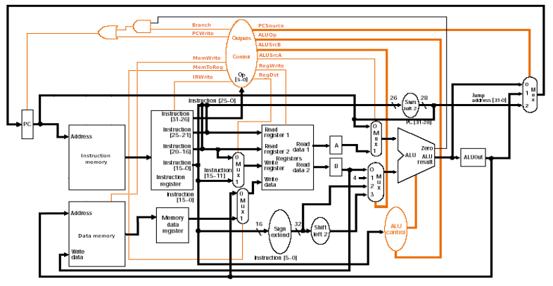
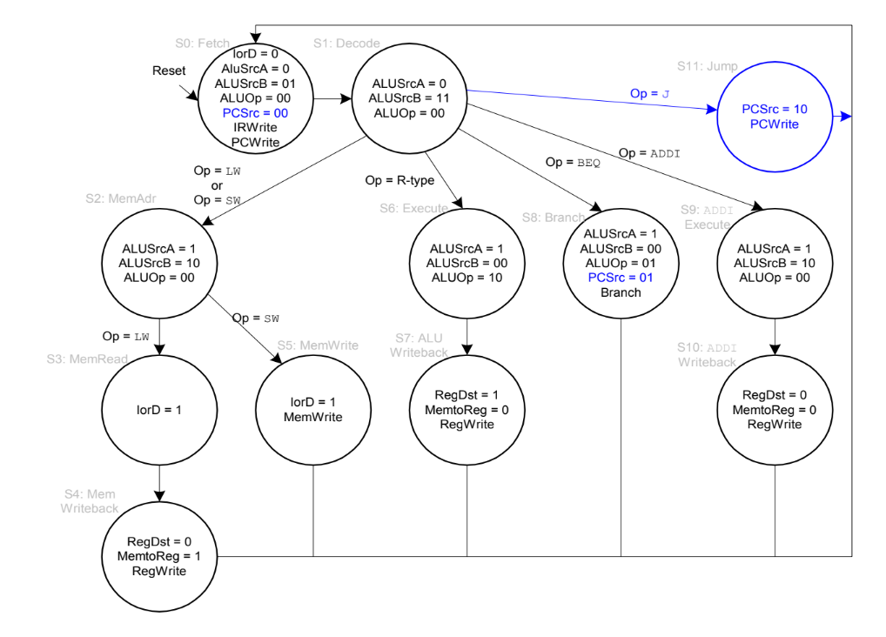
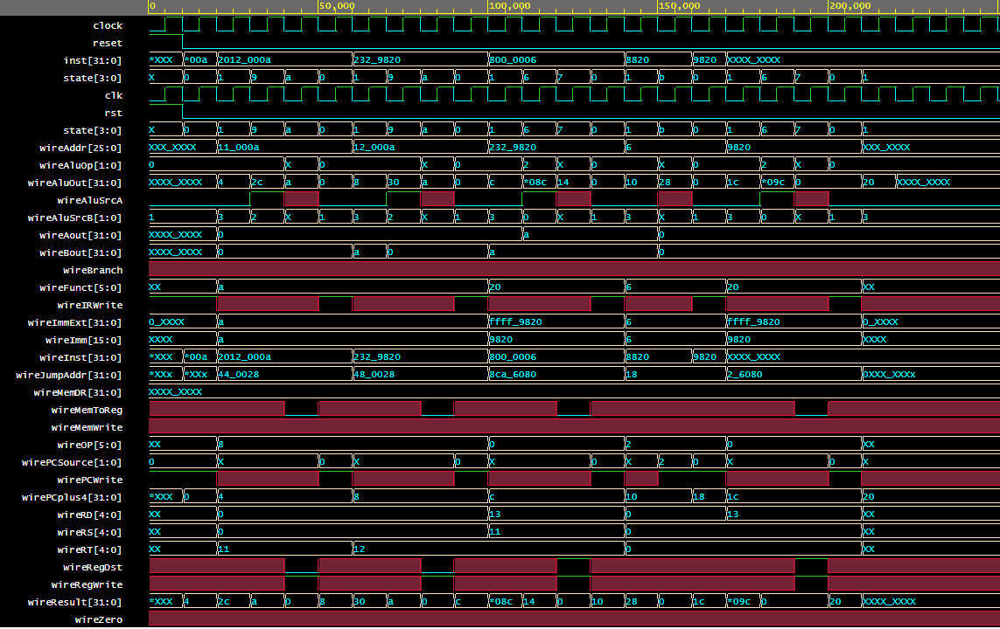

# MyRISKv2 - Processador Multiciclo em MIPS

## Descrição

Este projeto implementa um processador Multiciclo na arquitetura MIPS usando VHDL. Foi desenvolvido em sala durante as aulas de Organização e Arquitetura de Computadores II, juntamente com o amigo Lucas Emmanuel e o Professor Max Santana Rolemberg Farias da UNIVASF - Universidade Federal do Vale do São Francisco.

## Pré-requisitos

Para compilar e simular o projeto, você precisará de um ambiente VHDL adequado (por exemplo, Xilinx Vivado, ModelSim). Recomenda-se usar o EDAPlayground (simulador online que suporta várias linguagens de descrição de hardware).

## Como Usar

Para usar o processador, siga os seguintes passos:
1. Clone este repositório.
2. Abra o projeto em seu ambiente de desenvolvimento VHDL.
3. Compile o código.
4. Simule o design usando testbenches fornecidos.

## Datapath Monociclo

## Finite State Machine

## Simulação

Os resultados da simulação são gravados no diretório `simulations/waveforms/`. Analise esses resultados para verificar a correta execução das instruções.

## WaveForm do binário do arquivo example.out

